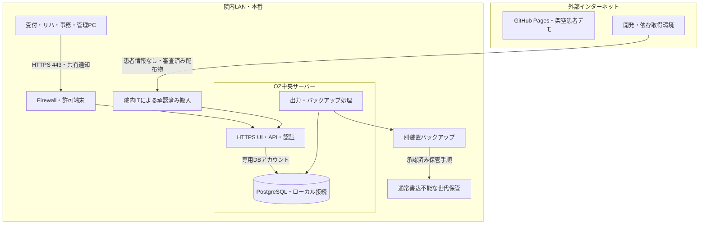
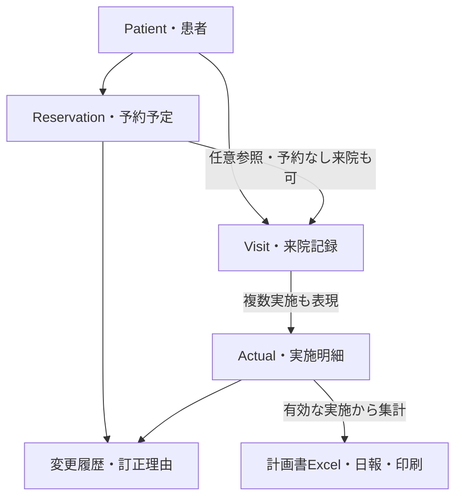

# 柴田屋OZ STAFF SYSTEM — Architecture v1

作成日：2026-10-04 / 状態：実装前レビュー案 / 対象：院内LAN本番システム

**推奨構成は「既存Web UI ＋ 院内中央API ＋ PostgreSQL」。** Windows用の外枠は、LAN版の動作確認後にTauriを評価して追加する。予約表の画面・操作を継承し、保存・履歴・競合制御を中央サーバーへ移す。今回の成果物は設計資料であり、アプリ本体、GitHub、DB、院内ネットワーク設定は変更していない。

## 1. 確定方針と設計範囲

一度入力した情報を、予約・実績・計画書・日報・出力で再利用する。本番データと通信は院内で完結させる。外部インターネットに接続しないことと、院内LANで中央サーバーに接続することは両立する。

| 区分 | Architecture v1で扱う内容 |
|---|---|
| 確定 | 本番は非公開の院内LAN、中央DB、複数PC、実患者データを外部へ送らない |
| 確定 | 月間シフトは縦PT×横1日～月末。カード型・1日型へ変更しない |
| 確定 | 20分枠、12列の順序、中央時間軸、午後のPTヘッダー再掲、既存Pointer操作 |
| 確定 | 手動20分Overrideがシフトより優先。730/715/700の閉鎖規則を推測しない |
| 確定 | 予約と実績は分離。既存Excel運用は段階的に連携する |
| 推奨・承認対象 | PostgreSQL、ASP.NET Core、段階的TypeScript化、Tauri候補 |
| 未確定 | Excel列・新患再来等の集計定義、Windows/サーバー環境、利用PC数、運用担当、復旧目標 |

詳細DBモデルは `DB_Schema_v1.md`、保護対象・移行・受入条件は `Migration_and_Review_v1.md` に分離する。

## 2. 既存資産の分析

今回読取確認したのは作業中の月間候補 `github-upload/index.html` と `oz-work/app.js`。v15/v16/v17の原本一式、GitHub公開中の実ファイル、実際の計画書Excelは揃っていない。そのため、過去版すべての比較完了や、公開版と同一であることは主張しない。

現候補には日付別予約、12人×月の日数の月間マトリクス、月切替、円形入力、患者操作メニューがある。ただし実ブラウザ・実スマホ・院内PCでの最終回帰確認は未完了。既存の58件のVM/DOMスタブによるロジック検証はPASSだが、完成したGolden Masterとは扱わない。

| 現在の実装 | 移行時の扱い |
|---|---|
| `renderBoard`、患者検索結果、Pointerドラッグ、固定ゴースト | 操作と画面構造を保護し、APIアダプターから得たデータで描画 |
| `renderShift`、月の日付生成、円形入力 | 縦PT×横日付、sticky、月切替を固定。入力結果だけ中央へ送信 |
| 日別 `shift / override / slotOverride / slots` | 日単位JSON全体を共有保存しない。正規化モデルと操作APIへ変換 |
| `localStorage` | デモ専用保存。LAN本番の正本には使用しない |
| `cancelBooking` が予約を削除 | UIの「解除」は保持。DBでは取消状態と履歴を残す |
| 新規患者を予約済枠へ置換すると上書き | 旧予約を置換終了として保存、新予約を作成、同一トランザクション |
| 患者設定は予約オブジェクトの区分・メモを変更 | まず「予約設定」として継承。患者マスター編集とは権限・操作を分ける |
| `slotOverride > override > shift` | 旧日別overrideを黙って捨てず、別エンティティで保存して移行。新UIでの扱いをレビュー |

UI資産は再利用するが、ブラウザがDBへ直接書く設計は引き継がない。既存の見た目を保ったまま、保存責務を操作単位で置き換える。

## 3. 推奨技術スタック

| 層 | 第一案 | 選定理由・条件 |
|---|---|---|
| Frontend | 現HTML/CSS/JavaScriptを継承、責務ごとにES Modules、順次TypeScript | 大規模な画面再実装を避ける。React等への刷新を前提にしない |
| ビルド | Vite候補、依存とロックファイル固定 | ビルド済み静的資産を同梱。npmや開発サーバーは本番で不要 |
| LANクライアント | 管理されたEdge等の院内ブラウザ | 初期検証と展開が容易。外部サイトへアクセスする必要なし |
| Desktop Shell | Tauri 2候補、後段でWindows試作 | 同じWeb UIを使用。WebView2と更新手段を含めて評価 |
| Backend | ASP.NET Core / .NET 10 LTS、Windows Service | 中央API・認証・トランザクション・出力を一つのサービスにまとめる |
| Database | PostgreSQL 18系の対応OSで検証した保守版 | 同時更新、制約、バックアップ・将来の復旧強化を重視 |
| DBアクセス | Npgsql、明示トランザクション。EF Core候補 | マイグレーションは管理者による明示適用。予約交換は制約を含め専用処理 |
| 共有通知 | SignalR候補 | 更新通知後に対象日データを再取得。DBコミットが正本 |
| Excel | ClosedXML候補、必要に応じOpen XML SDK | サーバー側でxlsx生成。既存ブックへの適合性で最終選定 |
| Print/PDF | 共通データDTOから専用HTML印刷画面 | 最初は院内ブラウザ印刷/PDF保存。自動PDFエンジンは後段 |
| テスト | ドメイン/API/実DB統合テスト、Playwright＋実Windows・実タッチ | スタブ検証と実機検証を区別する |

Windows ServiceはOS再起動後の自動起動が可能で、IISを必須としない。[S4] .NET 10は調査時点でLTSとして公開されている。[S5] バージョンは導入時にサポート期間・Windows対応・依存の組合せを再確認し、パッチ番号を固定する。

### Backendの代替案

Node.js LTS＋TypeScriptも既存JSとの言語統一に利点がある。ただし中央Windowsサービス・運用・xlsxをまとめる本案ではASP.NET Coreを第一案とする。保守担当者がNode.js中心であれば、同じAPI契約とDBモデルのまま再選定できる。マイクロサービス化、Docker必須化、多数の独立サーバーは初期には採用しない。

### 中央DBの比較

| 比較 | PostgreSQL | SQLite＋中央API | SQL Server Express等 |
|---|---|---|---|
| 同時更新 | 行ロック、トランザクション、DB制約を活用 | 書込みは同時に1つ。短い処理なら待合せで成立 | 中央DBとしての同時利用に対応 |
| 初期導入 | DBサービス・アカウント・更新運用が必要 | サーバー内ローカルファイルで導入は簡単 | 院内にSQL Server保守体制があれば候補 |
| Windows | 公式サイトからWindows用配布先を案内 [S3] | 別DBサービス不要 | エディション制限と院内ライセンス/運用条件確認 |
| 復旧 | dump/restore、将来はWALと時点復旧 [S2] | バックアップAPI等で整合するコピーが必要 | 製品に合わせたバックアップ/世代運用 |
| 将来拡張 | 予約・実績・監査・集計を同一DBで拡張 | 小規模中央サーバーなら十分な可能性 | 既存Microsoft運用との統合を重視する場合 |
| v1判断 | **第一候補** | 試験・小規模案として残す | 既存院内基盤がある場合の代替 |

SQLiteを「複数PCだから必ず不適切」とは判断しない。DBにSQLを発行する中央APIとSQLiteが同じサーバーにあれば成立する。一方、複数PCが共有フォルダー上のSQLiteを直接開く構成は採用しない。公式資料もこの差を明示し、同時書込みは1つと説明している。[S1]

今回のPostgreSQL推奨は患者2万人という件数だけが理由ではない。複数部門が予約・実績・監査を更新すること、予約交換の整合性、復旧手順の発展、保守担当が中央DBを運用できることを条件にした設計判断である。保守担当不在なら製品選択より先に運用責任を決める。

### Windows Shellの比較

| 候補 | 利点 | オフライン運用の注意 | 判断 |
|---|---|---|---|
| Tauri | Web UI再利用、OSのWebViewを活用、権限を限定しやすい | WebView2のオフライン配布・院内更新が必要。配布全体のサイズは測定する | 第一候補。実機試作後に確定 |
| Electron | Chromium/Nodeを同梱し描画環境を揃えやすい | 同梱ランタイムのパッチ配布、rendererのNode無効化・隔離等が必要 [S7] | Tauriとの印刷・Pointer差で代替評価 |
| WebView2を使う.NET外枠 | Windows/管理基盤に寄せやすい | WebView2配布・独自外枠の保守が必要 | Windows限定で院内ITに合う場合 |
| 院内ブラウザ | 端末ごとのアプリ配布を減らせる | ブラウザ更新・印刷・証明書の組織管理 | 初期LAN検証に採用 |

Tauriの標準ブートストラッパーはネット接続を必要とする方式があるため、そのまま本番に使わない。offlineInstallerまたは管理された固定WebView2の配布を評価する。[S6] 外枠があっても患者DBは中央サーバーだけに置く。常時外部更新サービスは使用しない。

## 4. 院内LAN構成とセキュリティ境界



図の搬入経路は本番のインターネット接続を意味しない。開発側で依存を取得してスキャン・署名/ハッシュを確認し、院内承認ルートで搬入する。USBや外部メールを勝手に前提にしない。

初期は専用中央Windowsサーバー1台でAPIとDBを運用する。通常業務PCへの同居を既定にしない。OS、設置場所、固定アドレス/院内DNS、UPS、休止無効化、サービス再起動、復旧用代替機は院内ITと確定する。単一サーバーの故障で共有は停止する。バックアップは高可用性を意味しない。

| 境界 | 許可する接続・権限 | 拒否/制限するもの |
|---|---|---|
| 院内PC→OZ | 承認端末からHTTPS、ユーザー認証、役割に応じたAPI | 全端末無条件許可、無認証編集、外部公開 |
| API→DB | 初期はサーバー内loopback。API専用最小権限 | クライアントから5432へ直結、DB共有フォルダー、DB管理者パスワード同梱 |
| 管理→サーバー | 限定管理端末と管理者。管理ポートは別管理 | 通常スタッフへのOS管理権限 |
| サーバー→外部 | 本番アプリの外部通信なし | クラウドDB、解析、外部フォント/API、クラウド障害ログ |
| 出力→保存先 | 権限確認した院内保存・印刷先 | 無制限の患者一覧ダウンロード、外部共有プリンター/クラウド同期先 |
| バックアップ | 専用権限、通常ユーザー書込不可、別装置/切離し世代 | 本番DBと同じ権限で全世代を消せる構成 |

IP Allowlistは端末への入口制限であり、誰が操作したかの認証を代替しない。小規模でも実患者試験の前に、管理者/編集/閲覧の最小権限、個人の識別、監査、復元確認を導入する。

認証第一案は院内ローカルの個人アカウント＋サーバーセッション。既存ADが利用可能ならWindows統合認証を比較して確定する。ブラウザ版は同一origin・HttpOnly/Secure Cookie・CSRF対策、Tauri版は許可origin/権限を別途検証する。外部認証プロバイダー必須にはしない。共有PCではロック・自動ログアウト、出力権限、端末識別を設計する。

HTTPSは院内CA等の信頼できる証明書を端末に配布し、有効期限と更新を管理する。証明書検証を無効にして解決しない。LAN・サーバー・クライアント・DBはそれぞれ異なる信頼境界とする。

患者データ応答は `Cache-Control: no-store` を基本とし、患者データをService Worker・localStorage・クラウド同期へ永続保存しない。氏名/自由記載はHTMLとして実行せず、DOM出力をエスケープする。CSP等の保護を段階導入する際は、現inline handlerを機能ごとに移し、操作回帰を確認する。表示・印刷・スプールに患者情報が残りうるため、端末管理も必要である。

## 5. モジュール構成とディレクトリ案

中央は一つのモジュール分割されたサービスとし、DBトランザクション内で予約・監査・共有通知記録を確定する。責務分離と単一配布は両立する。

```text
oz-staff-system/
  docs/
    architecture/          設計・判断記録・DBモデル
    requirements/          確定仕様と未決事項
  baseline/                承認された旧版・ハッシュ・回帰期待値
  frontend/
    src/ui/                予約表・月間マトリクス・患者メニュー
    src/reservation/       予約操作・表示モデル
    src/shift/             月間表示・円形入力
    src/patient/           検索・予約設定・患者マスター画面
    src/actual/            来院・実施記録
    src/print/             画面と分離した印刷レイアウト
    src/data/              API・デモ保存アダプター
    src/shared/            日時・型・共通操作
  server/
    Oz.Host/               HTTPS・API・サービス起動・認証
    Oz.Application/        操作・認可・トランザクション境界
    Oz.Domain/             Reservation・Shift・Patient・Actual規則
    Oz.Infrastructure/     DB・監査・共有通知・バックアップ連携
    Oz.Reporting/          Aggregation・Excel・Printデータ
  database/
    migrations/            順序付きDB変更・検証用データ
  desktop/
    tauri/                 院内接続先・限定権限・Windows配布
  tools/
    import/                旧データ・患者データ取込の検証
    backup/                管理者用保存・復元・検証
  tests/
    regression/            旧版と新保存方式の操作比較
    integration/           実DB・競合・履歴・出力
    e2e/                   PC・タッチ・印刷
  packaging/
    demo/                  架空データだけのPages成果物
    lan-server/            中央サービス・DB導入手順
    windows-client/        クライアント配布物
```

これは今後の構成案であり、空のプロジェクトや大量コードはまだ作成していない。本番DB・バックアップ・証明書秘密鍵・実Excel/患者データはリポジトリ外に置く。開発用テストは架空または適切に匿名化したデータを使う。

## 6. データモデルと予約可能枠

Patient、Staff、ScheduleResource、Shift、DayOverride、ReservationSlot、SlotOverride、Reservation、ReservationEvent、Visit、Actual、ActualEvent、AuditLogを分離する。IDは不変とし、PT名や患者名を関連のキーにしない。

「本院」が人・場所・物療資源のどれか未確定なので、表示行をScheduleResourceとして持つ。人員はStaffに別管理し、実績の実施者に使用する。UIには従来順の12行をそのまま出す。

枠は日付×表示資源×開始時刻で識別する。全未来日を大量保存せず、表示時に時間テンプレートから導出し、予約・上書き等で触れた枠だけ識別行を保存する。枠の現在状態はシフト等から計算し、同じ通常/閉鎖状態を多数の表へ複製しない。

```text
現在の枠状態 = SlotOverrideがあればその状態
             それ以外はDayOverrideがあればその勤務状態から計算
             それ以外はShiftから計算
```

SlotOverrideを削除する「シフト設定に戻す」は、旧DayOverrideがある場合も含めて基礎状態へ戻す。シフト入力で旧DayOverrideを解除する現操作も移行試験で確認する。通常日の未入力シフトは現仕様どおり通常として扱い、未入力の区別は管理表示で保持できる構造にする。

**重要な既存挙動：現在の `book()` は、通常枠への予約でも `slotOverride="normal"` を保存する。** 従って予約後にシフトを休みにしても、その予約枠は手動通常が優先される。移行でこの上書きを削除すると既存挙動が変わるため、原値を保存して可視化する。「正常枠の予約時には上書きを作らない」等への変更は別途承認と回帰テストを必要とする。

AM10＋PM13＝23開始枠、12列すべて通常でも最大276枠/日。休みや物療を除けば減る。1日300という目標が個別予約数なら現モデルとは両立せず、来院人数・実施明細数・物療を含むかを確認する。12:00/19:00も現在は開始枠として残し、終端解釈を勝手に変えない。

600は18:00以降閉鎖、午前休/午後休/全休を適用する。730/715/700は意味を追加しない。土日色分けは表示のみで、日曜閉鎖等は自動追加しない。物療枠への一般予約は原則禁止し、従来のメニューから通常化して予約する場合は二つの変更を原子的に保存する。

シフト変更で既存予約が閉鎖/物療枠と衝突しても、自動取消や非表示にしない。「要確認」を表示して担当者が変更/取消を決める。操作時に影響件数を返し、履歴に記録する。

## 7. 同時利用・同期・API設計

**日単位JSONの丸ごとPUTは使用しない。** 受付の予約変更とリハ室の実施登録が、最後に保存したPCによって互いに消えるためである。

| 操作APIの例 | 保存単位・条件 |
|---|---|
| `GET /api/v1/patients?number=...` | 番号文字列の完全一致。空検索は全件返さない |
| `GET /api/v1/patients?name=...&cursor=...` | 正規化部分一致、上限/次頁、検索結果だけ描画 |
| `GET /api/v1/board?date=...` | シフト・上書き・予約・実績要約の対象日スナップショット |
| `GET /api/v1/shifts?month=...` | 月間12行×日付とversion |
| `PUT /api/v1/shifts/{resource}/{date}` | 1セル更新、expectedVersion、影響予約を保持 |
| `PUT/DELETE /api/v1/slots/{id}/override` | 手動上書きの設定/解除、予約との衝突情報 |
| `POST /api/v1/reservations` | 空き枠検証、必要なら通常化と作成を同時確定 |
| `POST /api/v1/reservations/{id}/move` | 元/先の最新状態とversion、原子的移動 |
| `POST /api/v1/reservations/swap` | 2件・2枠のversionを確認して原子的交換 |
| `POST /api/v1/reservations/{id}/cancel` | 物理削除せず取消。枠は再利用可能 |
| `POST /api/v1/reservations/{id}/replace` | 旧予約を置換終了、新予約追加、履歴保存 |
| `POST /api/v1/visits` / `POST /api/v1/actuals` | 予約からの登録/予約なし実績、別IDで保存 |
| `POST /api/v1/exports/plan` | 範囲・実績・マッピング版で院内xlsx生成 |

更新はユーザー認証・操作権限・入力検証後、DBトランザクションで処理する。日付×資源のDayGuard行を作成してロックし、予約作成/移動/交換/上書き/シフト変更が同じ規則を同時に変更しないようにする。2資源/2日を扱う時は決まった順序でロックし、空枠でもロック対象を確保する。予約の一枠一件はDB制約でも強制する。[S8]

version比較は古い画面からの更新を検出する。競合はHTTP 409と最新情報を返し、黙って最後の保存を勝たせない。移動元/移動先の予約が確認後に変わった場合も再確認する。DBデッドロック/直列化失敗は限定回数だけ内部再試行し、操作の意味が変わる時は利用者へ返す。

各変更にoperationIdを付け、同一ユーザー・同一内容の再送は一回だけ適用する。同じキーで異なる内容は拒否する。通信断で保存結果不明になっても再送で二重予約を作らない。UIはサーバーの成功応答を受けて「保存済み」と表示する。

DBコミットと一緒にOutbox通知記録を保存し、commit後に対象日/資源/versionの通知を送る。通知に患者氏名を不要に載せない。通知は正本ではなく再取得のきっかけとし、再接続時は表示日/月を再取得する。通知が使えない場合は短い定期再取得へフォールバックする。共有遅延は院内で目標を合意して測定する。

LAN断/サーバー停止時は、新規保存を停止し、表示が最新でないことを明示する。各PCへの患者DB複製、localStorageへの書込み待ちキューによる自動同期はv1で導入しない。障害時は承認された紙運用に切替え、復旧後に担当者が差分を照合する。

## 8. ReservationとVisit/Actualの分離

予約は「予定」、Visitは「来院の事実」、Actualは「実施明細」。予約取消だけでは、すでに保存された実績を消さない。予約のPT/時間と、実際のPT/時刻が違っていても両方を保持する。



実施状態は、実施/未実施を別明細で記録する。実績取消・訂正はvoidedや訂正履歴を使い、物理削除しない。「変更」は予約履歴イベントであり、来院・実施・キャンセルが一つの排他的enumで全部表せるとは考えない。1来院に複数実施がありうる構造にする。

実施済みの予約を通常のドラッグで過去の別枠へ変更することは制限する。誤入力訂正は権限・理由付き操作とし、実施した担当/時刻は自動変更しない。新患/再来、リハ1、介護、事故、「まとめ」の業務意味は実Excelと運用確認後に決める。

## 9. 計画書Excel・日報・印刷

### 第一段階：現Excelとの接続

サーバーのReportingモジュールで、確定したActual/Visitと患者マスターから出力DTOを作る。候補列は患者番号・氏名・カナ・日付・時刻・担当PT・区分・実施状態。ただし今は候補であり、現在のExcelに対する列マッピングは未承認である。

Excel確認時はシート、テーブル、名前定義、数式、マクロ、ピボット、外部参照、保護、重複取込ルール、患者番号の先頭ゼロ、日付書式を検査する。第一案はExcelの入力シート/取込表へ渡すxlsxを生成し、既存の集計式をそのまま使う。原本へ無条件に上書きしない。

ClosedXMLはxlsx等の読書きライブラリ候補であり、Excelと同等の数式計算・既存マクロ動作を保証するものではない。[S9] 必要ならOpen XML SDKで指定部分だけを変更し、実Excelで開いた結果と期待値を比較する。Excelアプリをサーバーから常駐操作することは初期案に含めない。

各出力にexportId、対象期間、asOf、mappingVersion、集計規則版、対象actualIdを記録し、再出力/訂正/二重取込を識別する。単なるCSVをxlsx実装済みと呼ばない。ダウンロード権限と保存先を制限し、出力を監査する。

### 集計内製化と日報

最初は実ExcelとOZ出力を並行照合する。計画書の規則が一致してからReportingに移植する。将来の日報は同じActual/Visitを読むQuery Serviceを追加する。予約総数はReservation、来院数はVisit、実施明細数はActual、実施人数は患者の重複を除いた集計、と定義を分ける。

「日報作成」は指定営業日・集計版・asOfから作成し、再作成可能にする。締め後訂正は版を増やし、以前の日報を無言で置換しない。日報専用入力で患者情報を再入力させない。

### Print/PDF

PrintDataServiceから当日予約表/月間シフト/対象者/日報の専用レイアウトを生成する。画面の検索・編集・メニューは印刷しない。PC数やブラウザに関わらず同じ集計スナップショットを使う。

第一段階は院内ブラウザの印刷と「PDFとして保存」。Excel印刷をそのまま置換しない。自動PDFは、必要性が確認されたら院内同梱レンダラーを評価する。日本語フォント、ページ区切り、横長の月間表、繰返しヘッダー、物理プリンターを実機確認する。画面と印刷は別UIだが、集計ロジックは共通にする。

## 10. Audit・権限・バックアップ

AuditLogに操作者・サーバー時刻・端末識別・操作ID・対象・変更前後の必要項目・理由を記録する。監査を一般アプリ権限で更新/削除できないようにする。予約変更と監査保存は同一トランザクション。監査ログだけで治療明細を代替せず、業務履歴を別に持つ。

監査も患者情報を含む保護対象である。パスワード/トークンは記録せず、氏名/自由記載を無制限に複製しない。検索・出力・権限変更・認証失敗の監査も設計する。DB管理者による改変まで防げるとは主張せず、重要ログの別権限保管を段階導入する。

初期バックアップ案は毎日の整合したDBバックアップ、手動バックアップ、別装置コピー、世代管理、復元手順。保持案は日次14・週次8・月次12世代だが、院内の保持規則・容量・記録保管規程で確定する。DB以外にアプリ配布物、マイグレーション、設定、Excelマッピング/テンプレート、暗号鍵/証明書を復旧できる管理方法を用意する。

pg_dump等の論理バックアップと、base backup＋WALによる時点復旧を区別する。[S2] 日次バックアップだけならその間の更新を失う可能性がある。例えば「RPO 15分・RTO 4時間」は承認前の目標案であり、満たすにはWAL運用・代替機・復元試験が必要。日次dumpだけでこの目標達成とはしない。

通常アカウントから書けない世代を別に確保する。未承認USBは使わず、院内承認済みのバックアップ装置/媒体/保管手順を選定する。同じ装置の別フォルダーだけでは機器故障や全世代削除への備えにならない。バックアップ完了・失敗・残容量を管理画面に表示し、ネット非接続でも担当者が確認する。

本番試験前に別環境へ復元し、患者・予約・実績・監査・帳票を照合する。復元時は書込み停止、範囲確認、復元前の救済コピー、管理者による作業、DB/アプリ互換性確認、端末再取得、紙運用差分の取込を手順化する。

## 11. Phase別実装ロードマップ

| Phase | 内容 | 次へ進む条件 |
|---|---|---|
| 0：レビュー | 本資料、実Excel・端末/サーバー調査、旧版照合 | 構成・DB・境界・未決事項の扱いを承認 |
| 1：基準固定 | 正常版選定、実Windows/スマホ回帰、保護一覧、ハッシュ | 回帰PASS、利用者確認後にGolden Master昇格 |
| 2：中央基盤 | 架空患者、API、DB、認証、監査、競合・復元試験 | 同時予約/交換/シフト競合・通信断で欠落なし |
| 3：UI接続 | 保存アダプターを中央APIへ、予約/月間シフト共有 | 旧操作維持、複数PC共有、実機/印刷の受入PASS |
| 4：実績・Excel | Visit/Actual、現Excelの取込用xlsx、照合 | 規則/列承認、実Excel期待値一致、再出力・訂正確認 |
| 5：院内試験 | 限定利用、権限、バックアップ、障害対応、保守訓練 | 院内承認、外部通信なし確認、復元訓練、運用担当確定 |
| 6：Windows配布 | Tauri試作、オフライン導入、印刷/Pointer検証、更新配布 | 対応OS/ランタイム・署名・配布/戻し手順承認 |
| 7：将来拡張 | Excel集計内製化、日報、自動PDF、復旧強化 | 定義と実データ照合、監査・訂正・帳票受入PASS |

Windows外枠の試作は早めに並行評価できるが、院内版の正本DBを各PCへ移さない。期間や工数は端末条件・原本・運用確認後に見積もる。

## 12. レビューで決める事項

1. 中央API＋PostgreSQL第一案と、運用担当/導入可能なサーバーOS。
2. 予約UIを保護し、保存アダプターから段階移行する方法。
3. 初期の個人認証・閲覧/編集/管理・監査・HTTPS・端末制限。
4. Visit/Actualを別管理するモデルと、取消/訂正/無予約来院の扱い。
5. 現Excel原本確認後に出力マッピングと新患再来等の規則を確定すること。
6. バックアップ保持・復旧目標・障害時紙運用・保守更新責任。
7. 「本院」の意味、予約件数/来院人数/実施数の単位、300件時の容量モデル。
8. Tauriは候補で、オフライン導入と実機比較後に確定すること。

承認対象は設計方針であり、実Excelや実機を未確認のまま本番稼働を承認するものではない。**このレビュー承認まで、大規模コード置換は開始しない。**

## 参照資料（公式・一次資料）

技術的事実の根拠。選定と運用目標は本プロジェクトの設計判断。確認日2026-10-04。

- [S1] SQLite Appropriate Uses：<https://www.sqlite.org/whentouse.html>
- [S2] PostgreSQL Backup and Restore：<https://www.postgresql.org/docs/current/backup.html>
- [S3] PostgreSQL Windows installers：<https://www.postgresql.org/download/windows/>
- [S4] ASP.NET Core Windows Service：<https://learn.microsoft.com/en-us/aspnet/core/host-and-deploy/windows-service?view=aspnetcore-10.0>
- [S5] .NET support：<https://learn.microsoft.com/en-us/dotnet/core/releases-and-support>
- [S6] Tauri Windows installer：<https://v2.tauri.app/distribute/windows-installer/>
- [S7] Electron Security：<https://www.electronjs.org/docs/latest/tutorial/security>
- [S8] PostgreSQL constraints/concurrency：<https://www.postgresql.org/docs/current/ddl-constraints.html>、<https://www.postgresql.org/docs/current/mvcc.html>
- [S9] ClosedXML：<https://github.com/ClosedXML/ClosedXML>、<https://docs.closedxml.io/en/latest/concepts/formula-calculation.html>
